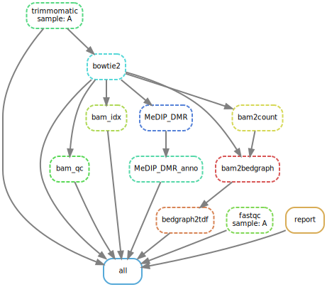

```{r setup, include=FALSE}
knitr::opts_chunk$set(echo = FALSE, comment = '')
library(yaml)
config <- yaml.load_file('../config.yaml')
env <- yaml.load_file('environment.yml')

version <- function(x) {
  strsplit(grep(paste0('^',x), env$dependencies, value = T), '=')[[1]][2]
}
```

## 1. Basic Information
```{r}
cat('Species:', config$species)
cat('Genome assembly:', rev(strsplit(config$index, '/')[[1]])[2])
cat('Sequencing Type:', config$seq_info$type)
cat('Sequencing Mode:', config$seq_info$mode)
cat('Replication number:', config$seq_info$replicate)
```

## 2. Sample Information
```{r}
data.frame(sample_names = config$samples)
data.frame(sample_info = unlist(config$sample_info))
```

## 3. Workflow


## 4. Results
### 4.1 Reads quality
We used **FastQC** (version `r version('fastqc')`) to check the sequencing quality. 

- [Output of FastQC](../fastqc)

### 4.2 Trim adapter sequence
We used **Trimmomatic** (version `r version('trimmomatic')`) to trim the adapter sequences. 

- [Output of Trimmomatic](../clean)

### 4.3 Reads mapping
We used **bowtie2** (version `r version('bowtie2')`) to map the clean reads. The multiple mapped reads were discarded by **samtools** (version `r version('samtools')`). We also checked the mapping quality by **qualimap** (version `r version('qualimap')`) 

- [Output of bowtie2 and qualimap](../bam)

### 4.4 IGV tracks 
We used **bedtools** (version `r version('bedtools')`) and **igvtools** (version `r version('igvtools')`) to generate normalized read profiles (Reads per Million) for each sample. The tdf files must be viewed in [IGV](http://software.broadinstitute.org/software/igv/). 

- [Tracks](../track)

### 4.5 Differential methlylation regions (DMRs)
We used **MEDIPS** (version 1.4) to identify the differential methlylation regions (DMRs). We annotated DMRs by the nearest genes and the GO terms of the corresponding genes by **ChIPseeker** (version `r version('bioconductor-chipseeker')`).

- [Idenified DMRs ( FDR < 0.1 )](../table/MeDIP_edgeR_DMR_anno.xlsx)

***
